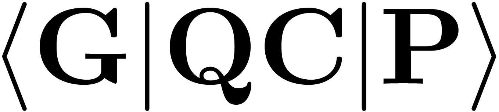

GQCP (Ghent Quantum Chemistry Package) aims to provide an open-source DSL for electronic structure method development in spinor bases. This DSL is implemented in a C++ library with Python bindings.
