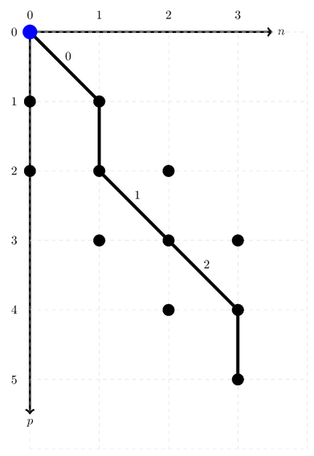
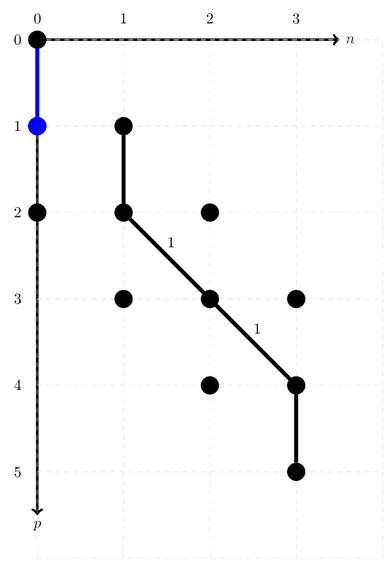
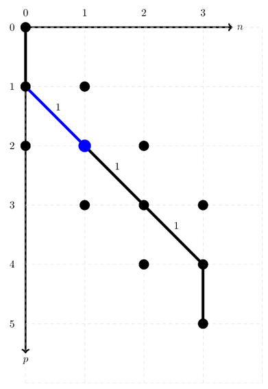
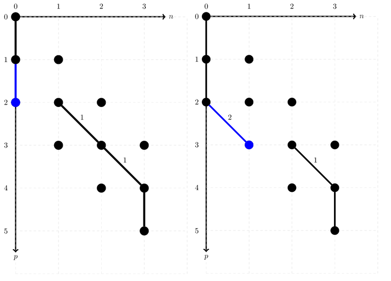

# Manipulating ONVs and their addresses


Understanding the inner workings of a low-level CI code can be daunting, mainly because bit string manipulations can be very hard to understand without any guidance. This section should help aspiring developers how GQCP deals with the manipulation of ONV's (occupation number vectors) and their path representation in an addressing scheme.

> Note: In order to understand the following section, it is necessary that you understand the theory first, since the code tries to follow the theory as closely as possible. To brush up on CI algorithms, ONVs and addressing schemes, we highly recommend chapter 11 in the 'purple bible' [Molecular Electronic‐Structure Theory](https://onlinelibrary.wiley.com/doi/book/10.1002/9781119019572) by Helgaker, Jørgensen and Olsen.


## One-electron excitations

ONV path manipulations are intuitively described using a second quantization approach, which GQCP's API sticks to as closely as possible by providing a class `ONVPath`. To manipulate an ONV path, we use the elementary second quantization operators to annihilate or create arcs that represent occupied orbitals. In an ONV path, a diagonal arc represents an occupied orbital, while a vertical arc represents an unoccupied orbital. As an example, we will use the path of the ONV `|10110>`.

<!--DOCUSAURUS_CODE_TABS-->

<!--Python-->
```Python
# Set up a F(5,3) Fock space.
onv_basis = gqcpy.SpinUnresolvedONVBasis(5, 3)

onv = gqcpy.SpinUnresolvedONV([0, 2, 3], 5)
onv_path = gqcpy.ONVPath(onv_basis, onv)
```

<!--C++-->
```C++
// Set up a F(5,3) Fock space.
const size_t M = 5;
const size_t N = 3;

const GQCP::SpinUnresolvedONVBasis onv_basis {M, N};

const auto I = GQCP::SpinUnresolvedONV::FromOccupiedIndices({0, 2, 3}, 5);  // |10110>
GQCP::ONVPath onv_path {onv_basis, I};
```

<!--END_DOCUSAURUS_CODE_TABS-->

Graphically, the state of the corresponding `ONVPath` may be pictorially represented as:



Since the address of an ONV is the sum of its diagonal arc weights, the address for `|10110>` is `2`.

> Notice the blue dot at the coordinate [0, 0]. This signifies that no annihilations on the ONV have taken place.

The function `annihilate()` removes the diagonal arc starting at the given coordinate in the ONV path.

```C++
/**
*  Annihilate the diagonal arc that starts at the coordinate (q,n).
* 
*  @param q        the index of the orbital that should be annihilated
*  @param n        the number of electrons in the ONV/path up to the orbital index q
*/
void ONVPath::annihilate(const size_t q, const size_t n) {

    // During annihilation, we're removing an arc, so we'll have to update the current address by removing the corresponding arc weight.
    this->m_address -= this->onv_basis.arcWeight(q, n);

    // Update the next possible creation index. Since we're always constructing paths from the top-left to the bottom-right, we're only considering creation indices p > q.
    this->p = q + 1;
}
```

There are three diagonal arcs (starting at [0, 0], [2, 1] and [3, 2]), which are the coordinates where `annihilate()` can remove an electron. Let's say we `annihilate(0, 0)`. The diagonal arc starting at [0, 0] will then become a vertical arc, resulting in a new, _open_ path, related to the ONV `|00110>`

> Note: An _open_ path represents the situation where the associated ONV belongs to a Fock space with less electrons.

<!--DOCUSAURUS_CODE_TABS-->

<!--Python-->
```Python
# Annihilate the electron in the orbital with index 0
onv_path.annihilate(0, 0)
```

<!--C++-->
```C++
// Annihilate the electron in the orbital with index 0.
onv_path.annihilate(0, 0);
```

<!--END_DOCUSAURUS_CODE_TABS-->



Since we have removed a diagonal arc with weight `1`, the current address of this open path is `2`. To _close_ the current path, we can use the `create()` function.

```C++
/**
*  Create the diagonal arc that starts at the coordinate (p, n).
* 
*  @param p        the index of the orbital that should be created
*  @param n        the number of electrons in the ONV/path up to the orbital index q, prior to the creation
*/
void ONVPath::create(const size_t p, const size_t n) {

    // During creation, we're adding an arc, so we'll have to update the current address by adding the corresponding arc weight.
    this->m_address += this->onv_basis.arcWeight(p, n);
}
```


In this particular case, the path can be closed by creating at coordinate [1, 0], resulting in a new ONV: `|01110>`.

<!--DOCUSAURUS_CODE_TABS-->

<!--Python-->
```Python
# Create an electron in the orbital with index 1
onv_path.create(1, 0)
```

<!--C++-->
```C++
// Create an electron in the orbital with index 1.
onv_path.create(1, 0);
```

<!--END_DOCUSAURUS_CODE_TABS-->




This was not the only way to close the path related to the ONV `|00110>`. Clearly, it is possible to create an electron in the orbital with index `4`. In order to update the path's state, we'll have to shift diagonal arcs (indicating occupied orbitals) to the left until a vertical arc is encountered to close the gap. For this purpose, GQCP offers the API `leftTranslateDiagonalArc()`.

```C++
/**
  *  Translate the diagonal arc that starts at the coordinate (p, n) to the left.
  * 
  *  @param p        the index of the orbital that should be annihilated
  *  @param n        the number of electrons in the ONV/path up to the orbital index p
  */
 void ONVPath::leftTranslateDiagonalArc(const size_t p, const size_t n) {

     // Translating a diagonal arc can be rewritten as an annihilation, followed by a creation.
     this->annihilate(p, n);
     this->create(p, n - 1);

     // Since a left-translation describes the process of 'encountering an electron/occupied orbital', the sign factor should be updated according to the fermionic anti-commutation rules.
     this->m_sign *= -1;
}
```

> Note: `leftTranslateDiagonalArc()` keep track of the overall sign of the annihilations and creations due to the fermionic anti-commutation relations.

The initial situation may be described in the following figure, on the left.



> Notice the blue dot at the coordinate [2, 0]. This means that the path's state is now ready to be modified starting at the orbital with index `2`.

We'll get started by moving the diagonal arc that starts at [2, 1], yielding the situation on the right.

<!--DOCUSAURUS_CODE_TABS-->

<!--Python-->
```Python
# Translate the diagonal arc that starts at (2, 1) to (2, 0).
onv_path.leftTranslateDiagonalArc(2, 1)
```

<!--C++-->
```C++
// Translate the diagonal arc that starts at (2, 1) to (2, 0).
onv_path.leftTranslateDiagonalArc(2, 1);
```

<!--END_DOCUSAURUS_CODE_TABS-->

Since we have removed an arc with weight `1`, and created one with weight `2`, the current address of this open path is `3`. After this translation, the situation is still very similar. The next possible creation index is still an occupied index, so we'll need to perform another translation.

<!--DOCUSAURUS_CODE_TABS-->

<!--Python-->
```Python
# Translate the diagonal arc that starts at (3, 2) to (3, 1).
onv_path.leftTranslateDiagonalArc(3, 2)
```

<!--C++-->
```C++
// Translate the diagonal arc that starts at (3, 2) to (3, 1).
onv_path.leftTranslateDiagonalArc(3, 2);
```

<!--END_DOCUSAURUS_CODE_TABS-->

Instead of translating the occupied arcs to the left manually, there is also the possibility to keep translating occupied arcs until an unoccupied, vertical ar is found. This is done with `leftTranslateDiagonalArcUntilVerticalArc()`. This function translates diagonal arcs using the `leftTranslateDiagonalArc()` function, until an unoccupied creation index is found. 

<!--DOCUSAURUS_CODE_TABS-->

<!--Python-->
```Python
# Keep translating diagonal arcs to the left, until an unoccupied index is found.
onv_path.leftTranslateDiagonalArcUntilVerticalArc()
```

<!--C++-->
```C++
// Keep translating diagonal arcs to the left, until an unoccupied index is found.
onv_path.leftTranslateDiagonalArcUntilVerticalArc();
```

<!--END_DOCUSAURUS_CODE_TABS-->

This will lead to the exact same ONV as performing the two `leftTranslateDiagonalArc()` functions separately. 


Since we've removed an arc with weight `1` and created one with weight `3`, the address of the resulting open path is `5`. Finally, we may close the path by creating an electron, since the next index now refers to an unoccupied orbital. The weight of the related diagonal arc is `4`, so finally the address of the resulting ONV is `9`.

<!--DOCUSAURUS_CODE_TABS-->

<!--Python-->
```Python
# Create an electron in the orbital with index 4.
onv_path.create(4, 2)
```

<!--C++-->
```C++
// Create an electron in the orbital with index 4.
onv_path.create(4, 2);
```

<!--END_DOCUSAURUS_CODE_TABS-->


