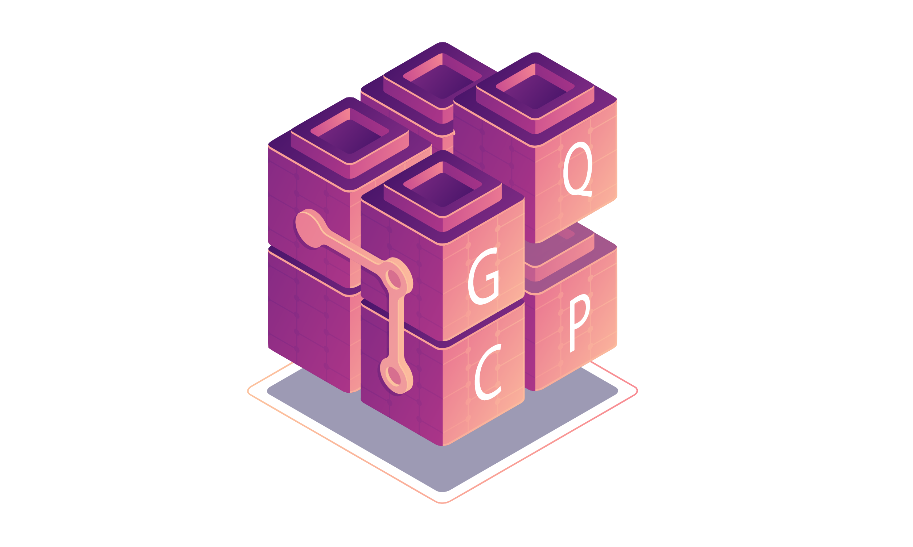

# The Ghent Quantum Chemistry Package

## Sustainable development & reproducible research
At the Ghent Quantum Chemistry Group, GQCG for short, our activities are centered around electronic structure for molecules.
We are trying to help create a community of quantum chemists that have a common mindset, suitable for (academic) research in the 21st century.
We are focused on sustainable and reproducible research, which is why our software developments are all open-source.
In order to support our research and development, GQCP saw its first light in 2017 and has been growing ever since.

## GQCWhy?

Conceptually, GQCP is like Lego.
Much like our favorite toys, GQCP provides building blocks to experiment with.
In just a handful lines of code, users can perform complex computations and developers can synthesize new and modify existing electronic structure methods.
Curious? Try it out!

## C++ and Python

- We use [pybind11](https://pybind11.readthedocs.io/en/stable/) to generate Python bindings for our C++ library.
Using `gqcpy` as a Python module, we can embrace Python's present role as a data manipulating language.
Gone are the days of providing input files or writing executables, with `gqcpy` and Jupyter notebooks you can naturally adapt a work flow that is both playful and systematic at the same time.

- GQCP is modern at its core. It is natively written in C++, so we have access to state-of-the-art software techniques and compilers.

## The GQCP development team

Here's a list of the GQCG members that contributed to this project.
